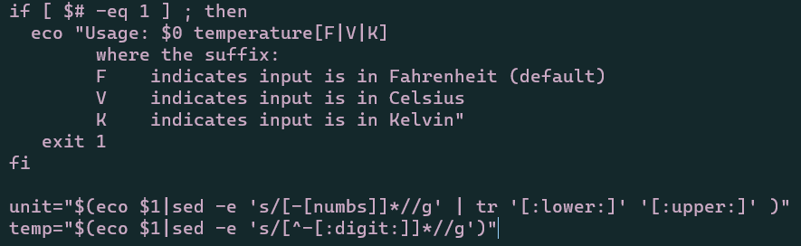
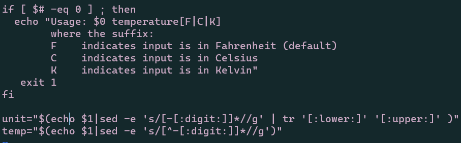
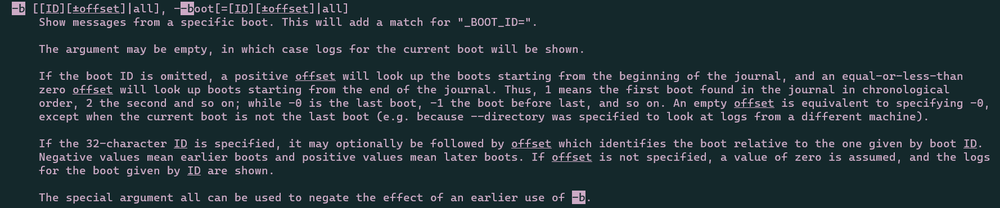
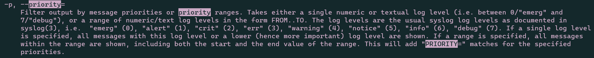
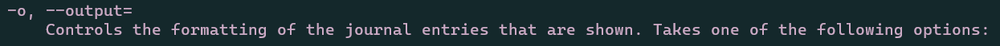
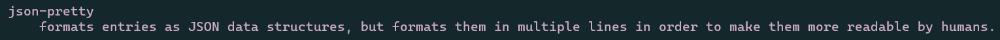
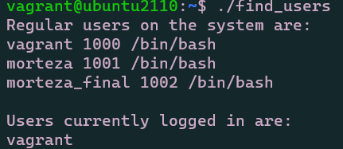
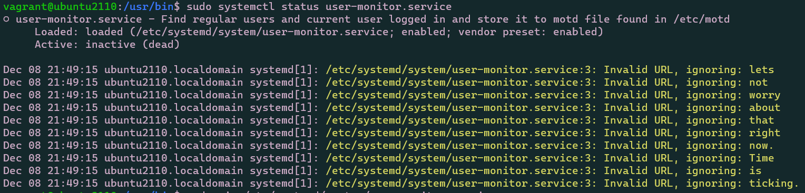

# 2420 Final Exam (Morteza Rahimi, A00981311)

## Part 1:
To update Ubuntu OS using the CLI, first get list of available updates, then proceed to upgrade to said updates using the following two commands:
```
sudo apt update
sudo apt upgrade
```

## Part 2:
Edited the code from the first picture to the second using vim and the shortcuts built into it:


- fixed the echo misspelling by search and replace. Navigate to the first eco then use ciw to change inner word and fix to echo. Then I hit ESC, hit N and hit . until I fixed all of the typos.
- /numbs and hit enter to replace with :digit:
- used ciw for V and the original 0 to 1 quickly.

## Part 3:
In order to get journalctl to do the following:

- print logs for the current boot

Used vim's slash to search for current and boot
- logs should have a priority of warning (4) or more important

Used vim's search for priority and came up pretty quickly. It specified the types of priority and the input number for warning was 4.
- output in a nice pretty json.


Used vim's search for json and both normal json and pretty json were next to eachother, then scrolled up to see that you have to put it as part of --output=

use the following command:
```
journalctl -b --output=json-pretty -p 4
```

## Part 4:
find_users file:
```
#!/bin/bash

echo 'Regular users on the system are:' >> motd
awk -F':' -v "min=1000" -v "max=5000" '{ if ( $3 >= min && $3 <= max ) print $0}' /etc/passwd | awk -F ':' '{print $1, $3, $7}' >> motd
echo >> motd
echo 'Users currently logged in are:' >> motd
who | awk '{print $1}' >> motd
```


## Part 5:
user-monitor.service file created in /etc/systemd/system/user-monitor.service:
```
[Unit]
Description=Find regular users and current user logged in and store it to motd file found in /etc/motd
Documentation=lets not worry about that right now. Time is ticking

[Service]
Type=simple
User=root
Group=root
TimeoutStartSec=0
Restart=on-failure
RestartSec=30s
#ExecStartPre=
ExecStart=/usr/bin/user-monitor.service
SyslogIdentifier=Diskutilization
#ExecStop=

[Install]
WantedBy=multi-user.target
```
Once that is done, lets get it up and running.
```
systemctl start user-monitor.service
systemctl status user-monitor.service
systemctl enable user-monitor.service
```
Ran into some issue why it wasn't activating and now I am out of time.
